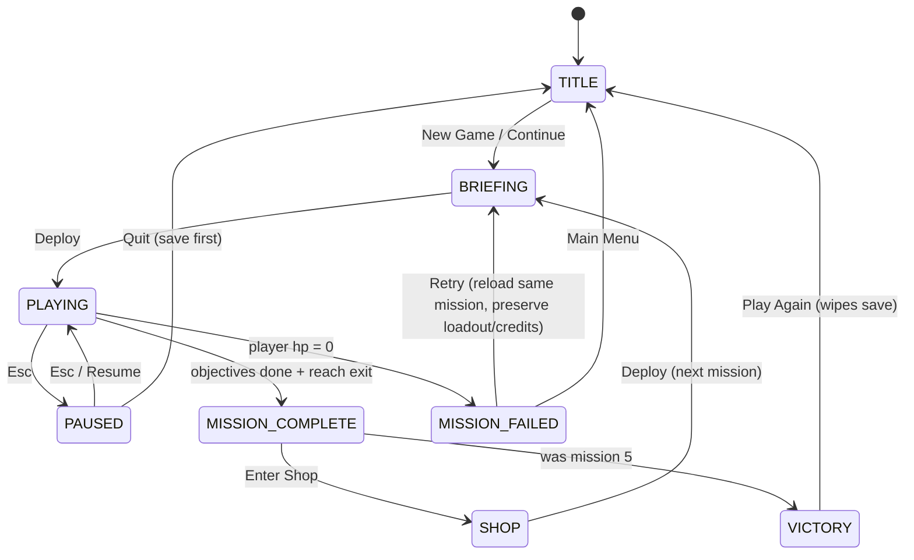

# Architecture Document: cyder-bogs

**Version:** 1.0
**Date:** 2026-05-20
**Author:** Systems Architect
**Status:** Draft

---

## 0. Scope & Anchors

This document specifies *how* cyder-bogs is built. It assumes the PRD (`docs/PRD.md`) and Design Spec (`docs/DESIGN.md`) are authoritative for *what* is built.

Hard constraints (from PRD section 9, "Tech Stack"):

- Runs entirely in the browser, no server, no backend, no build step.
- Must work both by opening `index.html` directly from disk **and** by serving over a local static file server.
- Pure HTML/CSS/JavaScript — no framework required.
- All game state in memory, plus `localStorage` for save/load.
- Maintainable by a single developer.
- No asset pipeline — sprites drawn programmatically with Canvas 2D.

These constraints drive every decision below.

---

## 1. Tech Stack Decision

### Choice: Vanilla JavaScript + Canvas 2D API. No framework. No bundler. No transpiler.

### Justification

| Option | Verdict | Reason |
|---|---|---|
| **Vanilla JS + Canvas 2D** | **Chosen** | Zero build step. Loads from `file://` or any static server. Total dependency surface = the browser. Trivial to maintain solo. Sprites are programmatic — we don't need an engine to load assets we don't have. |
| Phaser.js | Rejected | Heavy framework (~1MB). Designed around an asset pipeline we don't need. Adds learning curve for a solo dev. Overkill for ~5 missions of fixed-camera top-down shooter. |
| PixiJS | Rejected | Powerful WebGL renderer, but the design is explicitly low-res pixel art with `imageSmoothingEnabled = false`. Canvas 2D handles this perfectly at 60 FPS for the scale described. |
| Three.js / Babylon | Rejected | 3D engines for a 2D game. Wrong tool. |
| TypeScript | Rejected for MVP | Would require a build step. JSDoc comments give us 80% of the type-safety value with zero tooling. |
| ES Modules (`<script type="module">`) | Rejected for MVP | Browsers refuse to load ES modules from `file://` due to CORS. PRD explicitly requires opening `index.html` directly to work. We use classic `<script>` tags and a single `window.CB` namespace. |

### What we do use

- **HTML5 Canvas 2D API** — all rendering.
- **`requestAnimationFrame`** — main loop.
- **`localStorage`** — save/load.
- **`fetch()`** for map JSON — only when served from a real server. Maps are **also** embedded as fallback JS constants so `file://` opening still works. (See section 6.)
- **Google Fonts (`Press Start 2P`)** — loaded via `<link>`, with a `monospace` fallback.

### What we deliberately avoid

- No npm. No `package.json` for runtime. (Optional dev dependency: `http-server` via `npx` is fine for `run.sh`, never required to play.)
- No JSX, no Vue, no React.
- No webpack, no Vite, no Rollup, no esbuild.
- No Service Workers, no Web Workers (no need at this scale).
- No WebAudio in MVP (audio is explicitly out of scope per PRD section 1).

### What breaks first?

The bottleneck will be **canvas fillRect calls per frame**, not JavaScript execution. We mitigate this with viewport culling (only draw visible tiles), sprite caching (pre-render player/enemy sprites to off-screen canvases), and capping projectile/particle counts. See section 12.

---

## 2. File & Directory Structure

```
cyder-bogs/
├── index.html                  Entry point. Single file, opens directly in browser.
├── run.sh                      Local dev server + lifecycle commands. See section 13.
├── README.md                   Existing.
├── LICENSE                     MIT, optional.
│
├── docs/
│   ├── PRD.md                  (existing)
│   ├── DESIGN.md               (existing)
│   └── ARCHITECTURE.md         (this file)
│
├── css/
│   └── style.css               Canvas styling, body/page chrome. ~50 lines.
│
└── js/
    ├── main.js                 Bootstraps the game. Wires canvas, input, loop, state. Calls into Game.
    │
    ├── core/
    │   ├── constants.js        COLORS, TILE_SIZE, CANVAS_W/H, HUD_H, etc. No logic.
    │   ├── config.js           Weapon stats, enemy stats, mission rewards, shop prices.
    │   ├── utils.js            clamp, lerp, dist, aabb, rng, angleTo. Pure functions.
    │   ├── game.js             Game class. Owns state, runs loop, dispatches update/render.
    │   ├── loop.js             requestAnimationFrame driver, fixed-timestep update, variable render.
    │   ├── input.js            Keyboard + mouse capture. Exposes Input.keys, Input.mouse.
    │   ├── camera.js           Camera position/clamping. Follows player.
    │   ├── save.js             localStorage save/load. Schema versioned.
    │   └── states.js           StateMachine class. Used by game and by enemies.
    │
    ├── world/
    │   ├── tilemap.js          TileMap class. Loads/holds 2D tile arrays. Tile id -> solid lookup.
    │   ├── collision.js        AABB-vs-tilegrid, AABB-vs-AABB, ray-vs-tilegrid (LOS).
    │   └── maps/
    │       ├── mission1.js     Embedded map data as window.CB.MAPS[0] = { tiles, spawns, ... }
    │       ├── mission2.js
    │       ├── mission3.js
    │       ├── mission4.js
    │       └── mission5.js
    │
    ├── entities/
    │   ├── entity.js           Base entity factory (plain object shape + helpers).
    │   ├── player.js           Player update/render. Handles input, weapons, HP, armor.
    │   ├── enemy.js            Enemy factory + AI state machine driver.
    │   ├── projectile.js       Projectile spawn, update, collide, render.
    │   ├── pickup.js           Pickup spawn, update (idle), apply-on-overlap, render.
    │   └── particle.js         Lightweight particles (muzzle flash, explosion, blood).
    │
    ├── systems/
    │   ├── weapons.js          Weapon definitions + fire() function. Spawns projectiles.
    │   ├── ai.js               Enemy AI state transitions, LOS check throttle, steering.
    │   └── objectives.js       Mission objective tracker (KILL_ALL, KILL_TARGET, REACH_EXIT).
    │
    ├── screens/
    │   ├── screen.js           Base screen interface ({ enter, exit, update, render, onInput }).
    │   ├── titleScreen.js
    │   ├── briefingScreen.js
    │   ├── playScreen.js       Wraps the in-mission game world; not its own state subclass.
    │   ├── missionCompleteScreen.js
    │   ├── missionFailedScreen.js
    │   ├── shopScreen.js
    │   ├── pauseScreen.js
    │   └── victoryScreen.js
    │
    ├── render/
    │   ├── renderer.js         Top-level render dispatch. Calls current screen's render.
    │   ├── sprites.js          Programmatic sprite draw routines (player, each enemy, pickups).
    │   ├── tiles.js            Tile draw routines per tile id.
    │   ├── hud.js              In-mission HUD rendering.
    │   └── ui.js               Shared UI primitives: button, panel, label, modal.
    │
    └── data/
        ├── missions.js         Mission metadata: id, title, briefing, mapFile, objectives, reward.
        └── shop.js             Shop catalog ordering, tab definitions.
```

### Load order in `index.html`

```html
<!-- 1. constants and config first -->
<script src="js/core/constants.js"></script>
<script src="js/core/config.js"></script>
<script src="js/core/utils.js"></script>

<!-- 2. core systems -->
<script src="js/core/states.js"></script>
<script src="js/core/input.js"></script>
<script src="js/core/camera.js"></script>
<script src="js/core/save.js"></script>

<!-- 3. world -->
<script src="js/world/tilemap.js"></script>
<script src="js/world/collision.js"></script>
<script src="js/world/maps/mission1.js"></script>
<script src="js/world/maps/mission2.js"></script>
<script src="js/world/maps/mission3.js"></script>
<script src="js/world/maps/mission4.js"></script>
<script src="js/world/maps/mission5.js"></script>

<!-- 4. data -->
<script src="js/data/missions.js"></script>
<script src="js/data/shop.js"></script>

<!-- 5. entities and systems -->
<script src="js/entities/entity.js"></script>
<script src="js/entities/projectile.js"></script>
<script src="js/entities/particle.js"></script>
<script src="js/entities/pickup.js"></script>
<script src="js/systems/weapons.js"></script>
<script src="js/systems/ai.js"></script>
<script src="js/systems/objectives.js"></script>
<script src="js/entities/player.js"></script>
<script src="js/entities/enemy.js"></script>

<!-- 6. render -->
<script src="js/render/sprites.js"></script>
<script src="js/render/tiles.js"></script>
<script src="js/render/hud.js"></script>
<script src="js/render/ui.js"></script>
<script src="js/render/renderer.js"></script>

<!-- 7. screens -->
<script src="js/screens/screen.js"></script>
<script src="js/screens/titleScreen.js"></script>
<script src="js/screens/briefingScreen.js"></script>
<script src="js/screens/playScreen.js"></script>
<script src="js/screens/missionCompleteScreen.js"></script>
<script src="js/screens/missionFailedScreen.js"></script>
<script src="js/screens/shopScreen.js"></script>
<script src="js/screens/pauseScreen.js"></script>
<script src="js/screens/victoryScreen.js"></script>

<!-- 8. game and bootstrap -->
<script src="js/core/loop.js"></script>
<script src="js/core/game.js"></script>
<script src="js/main.js"></script>
```

### Namespace strategy

All files attach to a single global: `window.CB` (Cyder-Bogs). Each file checks/initializes it:

```javascript
window.CB = window.CB || {};
window.CB.Player = {
  create(opts) { /* ... */ },
  update(player, dt, world) { /* ... */ },
  render(player, ctx, camera) { /* ... */ }
};
```

This avoids ES module CORS issues on `file://` and keeps coupling explicit. Linting via "is `CB.X` defined when used" is sufficient.

---

## 3. Game Loop Architecture

### Strategy: Fixed-timestep updates, variable-rate rendering, capped frame-skip.

```
+-----------------+
| requestAnimationFrame(loop) |
+-----------------+
        |
        v
   loop(now):
     dt = now - lastNow
     lastNow = now
     accumulator += dt
     while (accumulator >= FIXED_DT):
       update(FIXED_DT)         <- deterministic, predictable
       accumulator -= FIXED_DT
       updatesThisFrame++
       if updatesThisFrame > MAX_UPDATES_PER_FRAME: break   <- spiral-of-death guard
     render(ctx, accumulator / FIXED_DT)   <- alpha for interpolation (optional)
     requestAnimationFrame(loop)
```

### Constants

```javascript
const FIXED_DT = 1 / 60;             // 60 Hz simulation (16.666 ms)
const MAX_UPDATES_PER_FRAME = 5;     // never spend more than ~83ms updating
const MAX_DT = 1 / 15;               // clamp dt to avoid huge catch-up jumps on tab return
```

### Why fixed-timestep?

- AI state transitions and projectile collisions are easier to reason about with a stable step.
- LOS checks are throttled per N updates, not per ms (simpler).
- Determinism makes bugs reproducible (e.g., enemies behaving differently on slow vs fast machines).

### `update(dt)` order each tick

```
1.  Input.poll()                       // snapshot key/mouse state
2.  Game.currentScreen.update(dt)      // screen-specific logic
    For the PlayScreen specifically:
    2a. Player.update(dt, world)
    2b. for each enemy: Enemy.update(dt, world, player)
    2c. for each projectile: Projectile.update(dt, world, entities)
    2d. for each pickup: Pickup.update(dt, player)   // overlap check
    2e. for each particle: Particle.update(dt)
    2f. Objectives.update(world)
    2g. Camera.follow(player)
    2h. cull dead entities/projectiles/particles
3.  Game.checkScreenTransition()       // e.g., player died -> MissionFailedScreen
```

### `render(alpha)`

Per design spec layer order (DESIGN.md section 2.3):

```
1. Clear canvas with COLOR_BG
2. Translate by -camera.x, -camera.y
3. Draw floor tiles                (only those in viewport)
4. Draw exit tile (locked or active)
5. Draw cover tiles
6. Draw pickups
7. Draw enemies (back to front by y? not needed top-down — fixed order is fine)
8. Draw player
9. Draw projectiles
10. Draw particles
11. Draw alert icons
12. Reset translate
13. Draw HUD (fixed overlay)
14. Draw top overlay (mission name, kill counter, objectives)
```

Screens other than PlayScreen render their own UI fullscreen — no world/camera layer.

### Interpolation

For MVP we skip render interpolation (`alpha` is unused). Sprites snap to integer pixels. At 60 Hz this looks fine for the pixel-art aesthetic. Reconsider only if we observe judder.

---

## 4. Entity System

### Choice: Plain JS objects + per-type modules with `create / update / render` functions. No class hierarchy. No ECS.

### Justification

- The PRD has 4 enemy types + 1 boss + player + projectiles + pickups. That's ~8 entity kinds. ECS is overengineering at this scale.
- Class hierarchies create rigid coupling. We want a Boss to share `enemy.update` logic but easily override fire behavior without `extends` gymnastics.
- Plain objects + factory functions: easy to inspect in DevTools, easy to serialize, easy to clone for retry-mission reset.

### Entity shape (universal fields)

```javascript
{
  // identity
  id: 17,                      // unique int per session, assigned by Game.nextId()
  type: 'enemy',               // 'player' | 'enemy' | 'projectile' | 'pickup' | 'particle'
  subtype: 'grunt',            // 'grunt'|'heavy'|'sniper'|'berserker'|'boss' for enemies; 'pistol'... for projectiles

  // transform
  x: 320, y: 160,              // world pixels, center of entity
  w: 20, h: 20,                // hitbox AABB (centered on x,y)
  angle: 0,                    // radians, for rotated sprites

  // physics
  vx: 0, vy: 0,                // velocity px/s
  solid: true,                 // participates in collision

  // lifecycle
  hp: 40, hpMax: 40,
  dead: false,                 // set true -> culled at end of update
  age: 0,                      // seconds alive (for lifetime checks)

  // type-specific blob
  data: { /* free-form */ }
}
```

### Entity creation

Each entity module exposes a factory:

```javascript
CB.Enemy.create({ subtype: 'grunt', x: 100, y: 200, patrol: [...] })
  -> returns a plain object matching the shape above
```

### Update / render dispatch

```javascript
// In Game.update:
for (const e of world.entities) {
  switch (e.type) {
    case 'player':     CB.Player.update(e, dt, world); break;
    case 'enemy':      CB.Enemy.update(e, dt, world, world.player); break;
    case 'projectile': CB.Projectile.update(e, dt, world); break;
    case 'pickup':     CB.Pickup.update(e, dt, world.player); break;
    case 'particle':   CB.Particle.update(e, dt); break;
  }
}
```

### Entity containers on the world object

```javascript
world = {
  player: { /* entity */ },
  enemies: [],
  projectiles: [],
  pickups: [],
  particles: [],
  tilemap: { /* TileMap */ },
  camera: { x, y },
  mission: { /* mission def */ },
  objectives: { /* progress */ },
  stats: { kills: 0, startTime: 0, shotsFired: 0 }
}
```

Separate arrays per type lets us iterate just enemies for LOS targeting, just projectiles for hit-testing, etc. Cheaper than filtering one big array each frame.

---

## 5. State Machine (Top-Level Game States)

### States

```
TITLE         - Title screen
BRIEFING      - Mission briefing before play
PLAYING       - Active gameplay (mission in progress)
PAUSED        - Paused overlay (Esc during PLAYING)
MISSION_COMPLETE   - Post-mission summary
SHOP          - Between-mission shop
MISSION_FAILED     - Death screen
VICTORY       - Campaign complete (after mission 5)
```

### Transition diagram



### Implementation

`CB.Game.setScreen(screenName, args)`:

```javascript
setScreen(name, args = {}) {
  if (this.currentScreen && this.currentScreen.exit) this.currentScreen.exit(this);
  this.currentScreenName = name;
  this.currentScreen = this.screens[name];
  if (this.currentScreen.enter) this.currentScreen.enter(this, args);
}
```

Each screen module implements:

```javascript
{
  enter(game, args) {},
  exit(game) {},
  update(dt, game) {},
  render(ctx, game) {},
  onKey(event, game) {},      // key down
  onMouse(event, game) {}     // mouse move/down/up/wheel
}
```

### Save triggers

- After SHOP (entering next BRIEFING) — saves progress.
- On entering MISSION_COMPLETE — to avoid losing progress if the user closes mid-shop.
- On entering MISSION_FAILED — preserves last good state for Retry.
- On manual "Save & Quit" from PAUSED.

Save is **not** triggered during PLAYING tick — only on state transitions. Avoids `localStorage` write churn.

---

## 6. Map System

### Map data shape

Each map is a JS file that registers itself into `window.CB.MAPS[missionId]`:

```javascript
window.CB = window.CB || {};
window.CB.MAPS = window.CB.MAPS || {};
window.CB.MAPS[1] = {
  id: 1,
  width: 15,                    // tiles
  height: 10,
  tiles: [
    [1,1,1,1,1,1,1,1,1,1,1,1,1,1,1],
    [1,0,0,0,0,0,0,0,0,0,0,0,0,0,1],
    [1,0,5,0,0,3,3,0,0,0,0,6,0,0,1],
    // ... rows of tile IDs (see PRD section 6, "Map Format")
    [1,1,1,1,1,1,1,1,1,1,1,1,1,2,1]
  ],
  spawns: {
    player: { tx: 2, ty: 2 },                                // tile coords
    enemies: [
      { type: 'grunt',  tx: 11, ty: 2 },
      { type: 'grunt',  tx: 8,  ty: 6, patrol: [{tx:8,ty:6},{tx:12,ty:6}] },
      { type: 'heavy',  tx: 13, ty: 8 }
    ],
    pickups: [
      { type: 'medkit_small', tx: 7, ty: 4 }
    ]
  },
  exit: { tx: 13, ty: 9 }       // matches a tile id == 2 (sanity-check at load)
};
```

### Tile IDs (mirrors PRD section 6)

| ID | Name | Solid | Notes |
|---|---|---|---|
| 0 | Floor | No | Default walkable. |
| 1 | Wall | Yes | Blocks movement and projectiles. |
| 2 | Exit | No (visual only) | Triggers mission complete when player overlaps AND objectives done. |
| 3 | Cover/Crate | Yes | Blocks movement and projectiles. |
| 4 | Door (open) | No | Visual only. No interaction. |
| 5 | Spawn (player) | No | Resolved at load, then treated as floor. |
| 6 | Spawn (enemy) | No | Same. Enemies positioned via `spawns.enemies[]` rather than tile metadata so we can attach patrol/type cleanly. |

### TileMap object

```javascript
CB.TileMap.create(mapData) -> {
  width, height,
  tiles: Uint8Array(width * height),    // flattened for perf
  isSolid(tx, ty),                      // bounds-checked; out-of-bounds = solid
  tileAtWorld(x, y),                    // returns tile id at world pixel
  tileToWorld(tx, ty),                  // returns {x, y} center
  forEachVisible(camera, cb)            // iterates tiles in viewport only
}
```

### Rendering

Only render tiles whose tile coords overlap the camera viewport. With a 30x30 map at most, the viewport already shows ~25x17 tiles — we still cull as a habit since later expansions may use larger maps.

```javascript
const tx0 = Math.max(0, Math.floor(camera.x / 32));
const ty0 = Math.max(0, Math.floor(camera.y / 32));
const tx1 = Math.min(width  - 1, Math.ceil((camera.x + 800) / 32));
const ty1 = Math.min(height - 1, Math.ceil((camera.y + 520) / 32));
for (let ty = ty0; ty <= ty1; ty++)
  for (let tx = tx0; tx <= tx1; tx++)
    CB.Tiles.draw(ctx, tileId(tx,ty), tx*32 - camera.x, ty*32 - camera.y);
```

### Collision detection

**Wall collision (entity vs tilegrid):** axis-separated AABB per PRD section 3.

```javascript
function moveAndCollide(entity, dx, dy, tilemap) {
  // X axis
  entity.x += dx;
  if (overlapsSolidTile(entity, tilemap)) {
    entity.x -= dx;
    // optional: nudge to tile edge
  }
  // Y axis
  entity.y += dy;
  if (overlapsSolidTile(entity, tilemap)) {
    entity.y -= dy;
  }
}
```

`overlapsSolidTile` samples the four corners of the entity's AABB and checks `tilemap.isSolid(tx, ty)` for each.

**Entity vs entity:** simple pairwise AABB. Player vs enemy uses a push-back (`resolveOverlap`). Projectile vs enemy uses overlap test.

**Projectile vs wall:** Each projectile tick, check the destination point against `tilemap.isSolid`. If solid, kill projectile (or trigger splash for rockets/grenades).

**Ray (LOS):** see section 9.

### Map dimensions (per PRD)

| Mission | Width | Height | Tiles | World px |
|---|---|---|---|---|
| 1 | 10 | 15 | 150 | 320 x 480 |
| 2 | 15 | 20 | 300 | 480 x 640 |
| 3 | 20 | 20 | 400 | 640 x 640 |
| 4 | 25 | 25 | 625 | 800 x 800 |
| 5 | 30 | 30 | 900 | 960 x 960 |

Largest map: 900 tiles, viewport shows ~430 tiles. Trivial for canvas at 60 Hz.

---

## 7. Input System

### Strategy: A polled snapshot object. Entities read from it; they don't subscribe to events.

### Why polling?

Game loop already runs at fixed steps. Event-driven input creates ordering hazards (key pressed and released within one frame both fire before update). Polling = stable: "what is the world's input state right now?"

We still attach event listeners, but they just mutate the snapshot.

### Snapshot

```javascript
window.CB.Input = {
  keys: {},              // { 'w': true, 'a': false, 'Shift': false, ... }
  keysPressed: {},       // edge-triggered: true for one frame after keydown
  mouse: {
    x: 0, y: 0,          // in canvas pixel coords (0..800, 0..600)
    worldX: 0, worldY: 0,// computed each frame from camera
    left: false,
    right: false,
    leftPressed: false,  // edge-triggered
    rightPressed: false,
    wheel: 0             // delta accumulated since last poll; reset by poll()
  },

  init(canvas) { /* attach DOM listeners */ },
  poll(camera) { /* update worldX/worldY; flip pressed flags off after use */ }
};
```

### Edge-triggered flags

`keysPressed[k]` is true for **exactly one frame** after a `keydown`. The pattern:

```javascript
// On keydown: keys[k] = true; if (!keysHeld[k]) keysPressed[k] = true; keysHeld[k] = true;
// End of game update: clear keysPressed for next frame
```

Used for: weapon switch (1/2/3), pause toggle (Esc), button presses on screens.

`keys[k]` (held) is used for: WASD movement, fire button (most weapons are auto-fire while held).

### Mouse coordinates

The canvas may be CSS-scaled. We convert client coords to canvas-internal (800x600) coords:

```javascript
canvas.addEventListener('mousemove', e => {
  const rect = canvas.getBoundingClientRect();
  CB.Input.mouse.x = (e.clientX - rect.left) * (canvas.width / rect.width);
  CB.Input.mouse.y = (e.clientY - rect.top)  * (canvas.height / rect.height);
});
```

World-space mouse (for aiming) is `screen + camera`.

### Key bindings (centralized)

```javascript
CB.Input.BIND = {
  moveUp:    ['w', 'ArrowUp'],
  moveDown:  ['s', 'ArrowDown'],
  moveLeft:  ['a', 'ArrowLeft'],
  moveRight: ['d', 'ArrowRight'],
  fire:      ['Space'],         // mouse-left is checked separately
  weapon1:   ['1'],
  weapon2:   ['2'],
  weapon3:   ['3'],
  pause:     ['Escape'],
  reload:    ['r']              // unused in MVP, reserved
};
CB.Input.isDown(action)   -> bool, any of the keys held
CB.Input.wasPressed(action) -> bool, any pressed this frame
```

---

## 8. Weapon System Architecture

### Strategy: Pure data definitions + a small `fire()` function. No weapon classes.

### Weapon definition (static data)

```javascript
CB.Weapons.DEFS = {
  pistol: {
    name: 'PISTOL', dmg: 15, fireRate: 3, range: 400, projSpeed: 450,
    ammoMax: 30, ammoStart: 30, cost: 0, sellable: false,
    spread: 0, pellets: 1, pierce: 0, splashRadius: 0, splashDmg: 0,
    projectileKind: 'bullet_yellow',
    fireBehavior: 'single'        // 'single' | 'spread' | 'continuous' | 'pierce'
  },
  shotgun: {
    name: 'SHOTGUN', dmg: 20, fireRate: 1.2, range: 200, projSpeed: 350,
    ammoMax: 20, ammoStart: 20, cost: 600, sellable: true,
    spread: 15 * Math.PI / 180,   // ±15 degrees in radians
    pellets: 5, pierce: 0, splashRadius: 0, splashDmg: 0,
    projectileKind: 'bullet_orange',
    fireBehavior: 'spread'
  },
  // ... machineGun, flamethrower, rocketLauncher, sniper, grenadeLauncher, laser
};
```

All values mirror PRD section 4 exactly. Single source of truth.

### Per-weapon runtime state (lives on owner)

```javascript
player.weapons = [
  { kind: 'pistol',  ammo: 30, cooldown: 0 },
  { kind: 'shotgun', ammo: 14, cooldown: 0 },
  null    // empty slot
];
player.activeSlot = 0;  // 0..2
```

`cooldown` is decremented each tick. Fires only when `cooldown <= 0`.

### Fire function

```javascript
CB.Weapons.tryFire(owner, world) {
  const slot = owner.weapons[owner.activeSlot];
  if (!slot) return;
  const def = CB.Weapons.DEFS[slot.kind];
  if (slot.cooldown > 0) return;
  if (slot.ammo <= 0) return;

  slot.ammo--;
  slot.cooldown = 1 / def.fireRate;

  const angle = CB.Weapons.computeAimAngle(owner, world);

  switch (def.fireBehavior) {
    case 'single':
    case 'pierce':
      spawnProjectile(owner, def, angle, world);
      break;
    case 'spread':
      for (let i = 0; i < def.pellets; i++) {
        const a = angle + (Math.random() * 2 - 1) * def.spread;
        spawnProjectile(owner, def, a, world);
      }
      break;
    case 'continuous':   // flamethrower
      spawnParticle(owner, def, angle, world);
      break;
  }

  if (def.kind === 'rocket' || def.kind === 'grenade') world.screenShake = 2;
}
```

### Projectile shape

```javascript
{
  type: 'projectile',
  ownerId: player.id,           // for friendly-fire skip and credit on kill
  x, y, vx, vy,
  w: 4, h: 4,
  damage: 15,
  range: 400,
  traveled: 0,                  // px so far; kill when > range
  pierce: 0,                    // hits remaining for piercing weapons
  splashRadius: 0,              // > 0 = explodes on impact
  splashDamage: 0,
  kind: 'bullet_yellow',        // for render dispatch
  dead: false
}
```

### Projectile tick

```javascript
update(p, dt, world):
  const step = Math.sqrt(p.vx*p.vx + p.vy*p.vy) * dt;
  const newX = p.x + p.vx * dt;
  const newY = p.y + p.vy * dt;

  // wall hit?
  if (world.tilemap.isSolidAtWorld(newX, newY)) {
    if (p.splashRadius > 0) explode(p, world);
    p.dead = true;
    return;
  }

  // entity hit? (skip owner)
  const target = findFirstHit(p, newX, newY, world);
  if (target) {
    target.hp -= p.damage;
    if (p.splashRadius > 0) explode(p, world);
    if (p.pierce > 0) { p.pierce--; } else { p.dead = true; return; }
  }

  p.x = newX; p.y = newY;
  p.traveled += step;
  if (p.traveled >= p.range) p.dead = true;
```

### Explosion / splash

```javascript
explode(p, world):
  for (const e of world.enemies):
    const d = dist(p, e);
    if (d <= p.splashRadius):
      e.hp -= p.splashDamage * (1 - d / p.splashRadius);  // linear falloff
  spawnParticle('explosion', p.x, p.y, p.splashRadius);
```

---

## 9. Enemy AI Architecture

### State machine per enemy

States (mirrors PRD section 5): `IDLE`, `ALERT`, `CHASE`, `ATTACK`, `PATROL`.

Each enemy carries:

```javascript
{
  type: 'enemy', subtype: 'grunt',
  x, y, hp, hpMax, w: 20, h: 20,
  weapon: 'enemy_pistol',         // simplified weapon ref
  weaponCooldown: 0,
  ai: {
    state: 'IDLE',                // current state
    stateTime: 0,                 // seconds in current state
    target: null,                 // last known player position {x, y}
    losClear: false,
    losCheckTimer: 0,             // throttle LOS check
    patrolWaypoints: [],          // [{tx, ty}]
    patrolIndex: 0,
    detectionRange: 200,          // from enemy config
    attackRange: 250,
    breakRange: 300,              // detectionRange * 1.5
    alertCueRemaining: 0          // seconds left to show "!" icon
  }
}
```

### Per-tick update

```javascript
update(enemy, dt, world, player):
  enemy.ai.stateTime += dt;
  enemy.ai.losCheckTimer -= dt;
  if (enemy.ai.losCheckTimer <= 0) {
    enemy.ai.losClear = hasLineOfSight(enemy, player, world.tilemap);
    enemy.ai.losCheckTimer = 0.2;  // 200ms throttle per PRD
  }
  const d = dist(enemy, player);

  switch (enemy.ai.state) {
    case 'IDLE':
      if (d < enemy.ai.detectionRange && enemy.ai.losClear) setState(enemy, 'ALERT');
      else if (enemy.ai.patrolWaypoints.length > 0) setState(enemy, 'PATROL');
      break;

    case 'PATROL':
      moveTowardWaypoint(enemy, dt, world);
      if (d < enemy.ai.detectionRange && enemy.ai.losClear) setState(enemy, 'ALERT');
      break;

    case 'ALERT':
      enemy.ai.alertCueRemaining -= dt;
      faceToward(enemy, player);
      if (enemy.ai.stateTime >= 0.6) setState(enemy, 'CHASE');
      break;

    case 'CHASE':
      moveTowardWithSteering(enemy, player.x, player.y, dt, world);
      if (d <= enemy.ai.attackRange && enemy.ai.losClear) setState(enemy, 'ATTACK');
      else if (d > enemy.ai.breakRange && !enemy.ai.losClear) {
        setState(enemy, enemy.ai.patrolWaypoints.length ? 'PATROL' : 'IDLE');
      }
      break;

    case 'ATTACK':
      faceToward(enemy, player);
      enemy.weaponCooldown -= dt;
      if (enemy.weaponCooldown <= 0 && enemy.ai.losClear) {
        fireEnemyWeapon(enemy, world);
        enemy.weaponCooldown = 1 / enemyWeaponDef(enemy).fireRate;
      }
      if (d > enemy.ai.attackRange || !enemy.ai.losClear) setState(enemy, 'CHASE');
      break;
  }
```

### Line-of-sight

```javascript
hasLineOfSight(from, to, tilemap):
  // Walk a ray from from -> to in increments of TILE_SIZE/2 (16px).
  // Sample tile at each step. If any is solid (wall/cover), return false.
  // Reach destination -> return true.
  const steps = Math.ceil(dist(from, to) / 16);
  for (let i = 1; i < steps; i++) {
    const t = i / steps;
    const px = from.x + (to.x - from.x) * t;
    const py = from.y + (to.y - from.y) * t;
    if (tilemap.isSolidAtWorld(px, py)) return false;
  }
  return true;
```

A ~960px diagonal at 16px steps = 60 samples. With 12 enemies checking LOS at 5 Hz (every 200ms), that's 12 × 5 × 60 = 3600 tile reads/sec. Trivial.

### Pathfinding: simple steering, not A*

Per PRD: "the simple wall-avoidance steering described in Section 5 is acceptable given small map sizes."

```javascript
moveTowardWithSteering(enemy, tx, ty, dt, world):
  const baseAngle = Math.atan2(ty - enemy.y, tx - enemy.x);
  const speed = enemy.moveSpeed;
  const tryAngles = [0, +Math.PI/4, -Math.PI/4, +Math.PI/2, -Math.PI/2];

  for (const offset of tryAngles) {
    const a = baseAngle + offset;
    const dx = Math.cos(a) * speed * dt;
    const dy = Math.sin(a) * speed * dt;
    if (canMoveTo(enemy, enemy.x + dx, enemy.y + dy, world.tilemap)) {
      enemy.x += dx; enemy.y += dy;
      enemy.angle = a;
      return;
    }
  }
  // all blocked: stay put this frame
```

### Patrol waypoints

```javascript
moveTowardWaypoint(enemy, dt, world):
  const wp = enemy.ai.patrolWaypoints[enemy.ai.patrolIndex];
  const wx = wp.tx * 32 + 16;
  const wy = wp.ty * 32 + 16;
  if (dist(enemy, {x:wx,y:wy}) < 8) {
    enemy.ai.patrolIndex = (enemy.ai.patrolIndex + 1) % enemy.ai.patrolWaypoints.length;
  } else {
    moveTowardWithSteering(enemy, wx, wy, dt, world);
  }
```

### Boss

The boss has its own micro-FSM for weapon alternation (Rocket Launcher / Machine Gun burst), composed on top of the normal AI:

```javascript
boss.ai.weaponMode = 'rocket' | 'mg_burst';
boss.ai.modeTimer = ...; // switch modes every 4 seconds
boss.ai.burstShotsRemaining = 0;
```

In `ATTACK` state, the boss reads `weaponMode` to choose which projectile to spawn. Otherwise it shares the regular enemy state machine.

---

## 10. HUD & UI Rendering

### Choice: Canvas-drawn HUD and screens. No DOM/HTML overlays.

### Why canvas-drawn?

- The PRD requires the canvas to scale to fill the window while preserving aspect ratio. HTML overlays would need to track that scaling separately and stay aligned. Canvas-drawn UI is automatically in sync.
- The aesthetic is bitmap-pixelated. CSS smoothing would betray the look.
- Single render path makes scaling, screenshotting, and future "render to PNG" tasks trivial.
- Total UI complexity is low — ~6 screens, each ~200 lines of layout. Cheaper than building a DOM-canvas hybrid.

### Tradeoffs

- We re-implement primitives (button, hover/focus state, modal). Not free — but bounded.
- No native browser text input. We don't need one (no name entry in MVP).
- Accessibility relies on `aria-label` on the canvas (per DESIGN.md section 11) and on keyboard nav we implement ourselves.

### UI primitives (`render/ui.js`)

```javascript
CB.UI.button({ x, y, w, h, label, state /* 'primary'|'inactive'|'danger' */, focused, hovered });
CB.UI.panel({ x, y, w, h, borderColor, fillColor });
CB.UI.label({ x, y, text, size, color, align });
CB.UI.bar({ x, y, w, h, fillRatio, fillColor, bgColor });
CB.UI.modal({ message, choices: [{ label, onConfirm }] });
```

Each is a pure draw function. No retained state.

### Click hit-testing

Each screen maintains an array of "interactive rects":

```javascript
shopScreen.hitTargets = [
  { rect: {x, y, w, h}, action: () => buyWeapon('shotgun') },
  // ...
];
```

On mouse click: iterate, find first overlap, invoke action. Cleared and rebuilt each frame (no GC concern at this scale).

### Focused element (keyboard nav)

Each screen tracks `focusedIndex`. Tab/Shift+Tab cycles. Enter fires `action`. Focused button gets a 2px green border per design spec.

### HUD layout (PlayScreen)

Per DESIGN.md section 3. Implemented in `render/hud.js`:

```javascript
CB.HUD.draw(ctx, player, mission, stats):
  // Bottom 80px bar at y=520
  drawBackground();         // #050505 fill, #2A2A2A top border
  drawHPSection(player);    // x:8 y:528 w:152
  drawWeaponSlots(player);  // x:180 y:528 w:440
  drawCredits(player);      // x:660 y:528 w:140
  // Top overlay y=0 h=20
  drawTopOverlay(mission, stats);
```

The HUD is a separate render pass that does **not** apply the camera transform. The world is rendered first (with camera translate), then we reset the transform and draw HUD on top.

---

## 11. Save/Load System

### Storage

Single `localStorage` key: `cyder-bogs:save:v1`.

### Schema

```json
{
  "version": 1,
  "timestamp": 1747720800000,
  "missionIndex": 2,
  "credits": 1240,
  "armor": 25,
  "weapons": [
    { "kind": "pistol",  "ammo": 30 },
    { "kind": "shotgun", "ammo": 14 },
    null
  ],
  "activeSlot": 0,
  "stats": {
    "totalKills": 12,
    "totalCreditsEarned": 1640,
    "totalTimeSec": 624
  }
}
```

### What is NOT saved

- Player position (resets to mission spawn on retry/continue).
- Enemy state (rebuilt from map data).
- Projectiles, particles, pickups (transient).
- Current screen (resume always lands on BRIEFING for the saved missionIndex).

### Save trigger points (recap)

| Event | Triggers save |
|---|---|
| Mission complete (entering shop) | Yes |
| Leaving shop (deploying to next mission) | Yes |
| Mission failed | Yes (to preserve last loadout) |
| Manual quit from pause | Yes |
| During gameplay | No |

### Load behavior

`CB.Save.load()` returns `null` if no save or version mismatch. Title screen's "Continue" button is greyed when null.

```javascript
CB.Save.load():
  try {
    const raw = localStorage.getItem('cyder-bogs:save:v1');
    if (!raw) return null;
    const obj = JSON.parse(raw);
    if (obj.version !== 1) return null;
    return obj;
  } catch (e) { return null; }
```

### Wipe

Victory screen "Play Again" and (optional) title screen "Wipe save" both call `CB.Save.clear()` which does `localStorage.removeItem('cyder-bogs:save:v1')`.

### Versioning policy

If schema changes post-MVP, bump the version key. Old saves are silently treated as missing (greys out Continue) rather than attempting risky migrations.

---

## 12. Performance Considerations

### Targets (from PRD success criterion 10)

- ≥ 30 FPS on mid-range laptop, Chrome.
- We aim higher: stable 60 FPS at typical mission load (12 enemies, ~30 active projectiles, ~30 particles).

### Expected per-frame cost (worst case: mission 5 with boss)

| Work | Quantity | Rough cost |
|---|---|---|
| Tile draws (visible only) | ~430 | 430 fillRect calls |
| Enemy renders | ~8 | 8 × ~6 rects each = ~50 |
| Player render | 1 | ~6 |
| Projectile renders | ~40 (boss MG + rockets) | ~40 |
| Particle renders | ~30 | ~30 |
| HUD | 1 pass | ~40 ops |
| Pickup renders | ~5 | ~10 |

Total: ~600 canvas ops/frame. Canvas 2D handles 10,000+ ops/frame comfortably.

### Watchlist (what breaks first)

1. **GC churn from object allocation in the hot path.** Mitigate: reuse temp objects in `utils.js` (e.g., one shared `{x, y}` for vector math). Avoid `.map`, `.filter` on entity arrays each frame — use `for` loops with `dead` flag culling.

2. **Per-frame LOS for many enemies.** Mitigated by 200ms throttle (PRD). 12 enemies × 5 checks/sec is fine.

3. **Off-screen sprite work.** Cache rotated player sprite if profiling shows it's expensive — pre-render N rotation steps to off-screen canvas. Not needed unless we see issues.

4. **Tile fill loops.** Pre-compute the wall edge accents once per tile id into an off-screen canvas if needed; draw with `drawImage`. Defer until we measure.

5. **Particle spam from flamethrower.** Cap particles at 200 active. Oldest dies first.

6. **localStorage on hot path.** Never write during PLAYING. Only on state transitions.

### Profiling approach

Chrome DevTools Performance tab. Sample a 5-second mission slice. Look for: long frames (> 16.6ms), GC pauses, `fillRect` hot lines, `Math.atan2` overuse. No premature optimization — measure first.

### Mobile

Out of scope for MVP, but the canvas-only architecture means a future touch-control overlay can be added as a thin DOM layer.

---

## 13. Development & Run Script

### `run.sh` requirements

Standard run.sh per workspace convention. Commands:

```
./run.sh start      Start static file server on :8080 (background)
./run.sh up         Alias for start
./run.sh stop       Stop the server
./run.sh restart    Stop + start
./run.sh logs       Tail server logs
./run.sh build      No-op in MVP (no build step). Echo "no build needed".
./run.sh status     Show running/not running + port + URL
./run.sh test       Run lint or smoke test (see below)
./run.sh shell      Open a shell in the repo root
./run.sh clean      Remove any cached/generated files (mostly nothing for us)
./run.sh help       Print this help
```

### Server choice

Use Python's built-in: zero install on any developer machine with Python 3.

```bash
python3 -m http.server 8080 --directory . > .runtime/server.log 2>&1 &
echo $! > .runtime/server.pid
```

Fallback if Python isn't present: `npx http-server -p 8080`. Detect in run.sh and use whichever exists.

### Two ways to play

1. **Open `index.html` directly in browser** — works because all maps are embedded JS, no `fetch()` required.
2. **`./run.sh start` then visit `http://localhost:8080`** — preferred for development (DevTools network panel, no `file://` quirks).

### Smoke test (`./run.sh test`)

A minimal smoke test that runs the game in a headless context isn't required for MVP. For now:

```bash
# Lint-only check: confirm no syntax errors via node parse
find js -name '*.js' -print0 | xargs -0 -n1 node --check
```

Optional post-MVP: Puppeteer-based "load page, advance to mission 1, fire pistol, expect no errors" smoke.

### `.runtime/` directory

Used by `run.sh` for pid file and logs. Add to `.gitignore`.

```
.runtime/
node_modules/
*.log
.DS_Store
```

---

## 14. Implementation Order (Suggested)

Build outside-in. Each step ends with a playable artifact.

1. **Step 0 — Skeleton.** `index.html`, `style.css`, empty `main.js`. Canvas appears black. `run.sh` works.
2. **Step 1 — Game loop + input.** Fixed-step loop runs. Press WASD to log keys. No game yet.
3. **Step 2 — Tilemap + render.** Hardcode mission 1 tile array. Draw floor + walls. Camera at 0,0.
4. **Step 3 — Player.** Spawn, WASD movement, wall collision (axis-separated). Camera follows.
5. **Step 4 — Pistol + projectiles.** Click to fire, projectile travels, dies on wall hit.
6. **Step 5 — One enemy type (Grunt).** IDLE state only. Render. Then ALERT/CHASE/ATTACK.
7. **Step 6 — Damage + death.** Enemy takes damage, dies. Player takes damage from enemy projectile.
8. **Step 7 — Objectives + mission complete.** KILL_ALL counter, REACH_EXIT, transition.
9. **Step 8 — All weapons.** Add each weapon's behavior. Test in mission 1.
10. **Step 9 — All enemies.** Heavy, Sniper, Berserker. Patrol behavior for Grunt/Heavy.
11. **Step 10 — Pickups + credits drop.**
12. **Step 11 — HUD.** All HUD elements per DESIGN.md.
13. **Step 12 — Shop screen.** Buy/sell weapons, ammo, armor.
14. **Step 13 — Title + Briefing + Failed + Complete screens.**
15. **Step 14 — All 5 maps + missions 2–5 enemy configs.**
16. **Step 15 — Boss + Victory screen.**
17. **Step 16 — Save/load.** localStorage hookup + Continue button.
18. **Step 17 — Polish.** Screen shake, particle effects, alert icons, exit pulse, accessibility nav.

### Risky areas (flag for careful testing)

- **AABB sliding into corners.** Easy to get stuck on inside corners. Test by holding W+D into a corner.
- **LOS through cover tiles.** Crates are solid for movement and projectiles, but should they block LOS? Per PRD: yes, anything `solid` blocks the ray. Confirm in QA.
- **Projectile fast-moving through thin walls.** Sniper at 900 px/s, ticking at 60 Hz = 15 px/step. Less than wall thickness (32). Safe. Document this assumption.
- **Boss split AI (mode switching).** Test all transitions and ensure no infinite cooldown bugs.
- **Save during transitions.** Ensure we don't write a half-formed state. Save AFTER setScreen completes.

### Monitoring / debug

Add a debug HUD togglable with `~` key:

```
FPS: 60
Entities: 12 enemies, 23 projectiles, 14 particles
Player: x=320 y=160 hp=85 armor=25
Mission: 2  Kills: 3/8
AI state distribution: idle:2 patrol:3 chase:1 attack:0
```

Cheap to render. Invaluable during development. Hidden by default in release.

---

## 15. Open Architectural Questions

(These do not block implementation but should be revisited.)

1. **Sprite cache.** Pre-render rotated player sprite to N angles? Defer until profiling shows it matters.
2. **Pooling vs per-frame allocation.** Projectile/particle pooling is easy to add later if GC pauses appear. Start without pooling; revisit at step 17.
3. **Map authoring tool.** Hand-editing 30x30 JS arrays for mission 5 is tedious. Post-MVP: build a tiny HTML tile editor that exports JS. Not blocking MVP.
4. **Determinism / replay.** Fixed timestep gives us partial determinism. Full replay would require seeded RNG. Out of scope.

---

*End of Architecture Document*
